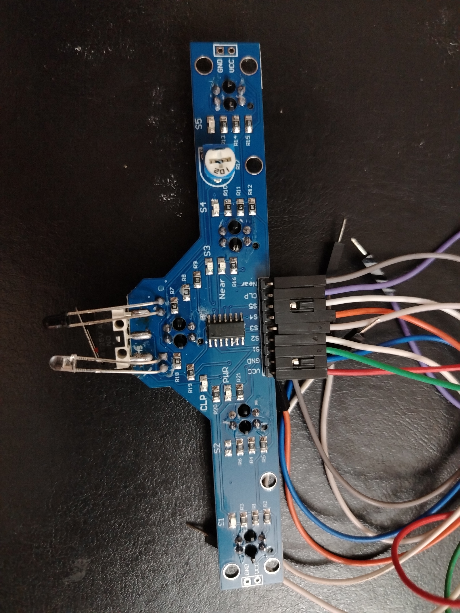

   

# BFD1000 5 Channel Line follower sensor with clip and obstacle detection

  

- [Read the documentation for project](docs/info.md)

This project implements the combinatory logic for the BFD1000 Line follower sensor. This sensor includes 5 channels for line detection and two additional channels: Clip for collision and Near for distance.
This project was first started as a Wokwi project at https://wokwi.com/projects/461375630008882177
followed by a Verilog implementation for hardware simulations on the Nexuys4 FPGA board.

## Participants
Amine HADJ ABDELKADER
Choukri BENSALAH
Boublenza Rokia Nassima 
NEGGAH Asma 
CHIKH Sofiane Alaa edibine 
Zitouni Benamar 
Hammouti Mousseme Eddine 
Haddouche Arslane 
Tourabi Marwa 
Raja Fatima Zohra Ines 
Nedjadi Fatima 
Loukili Nacera 
Bensenane Chahinez 
Guendouz Fatimazahra
## Resources

- [FAQ](https://tinytapeout.com/faq/)
- [Digital design lessons](https://tinytapeout.com/digital_design/)
- [Learn how semiconductors work](https://tinytapeout.com/siliwiz/)
- [Join the community](https://tinytapeout.com/discord)
- [Build your design locally](https://www.tinytapeout.com/guides/local-hardening/)

## Acknowldgement

This project is carried out with the support of the IEEE Open Silicon initiative. and TinyTapout project, to learn more and get started, visit https://tinytapeout.com.
